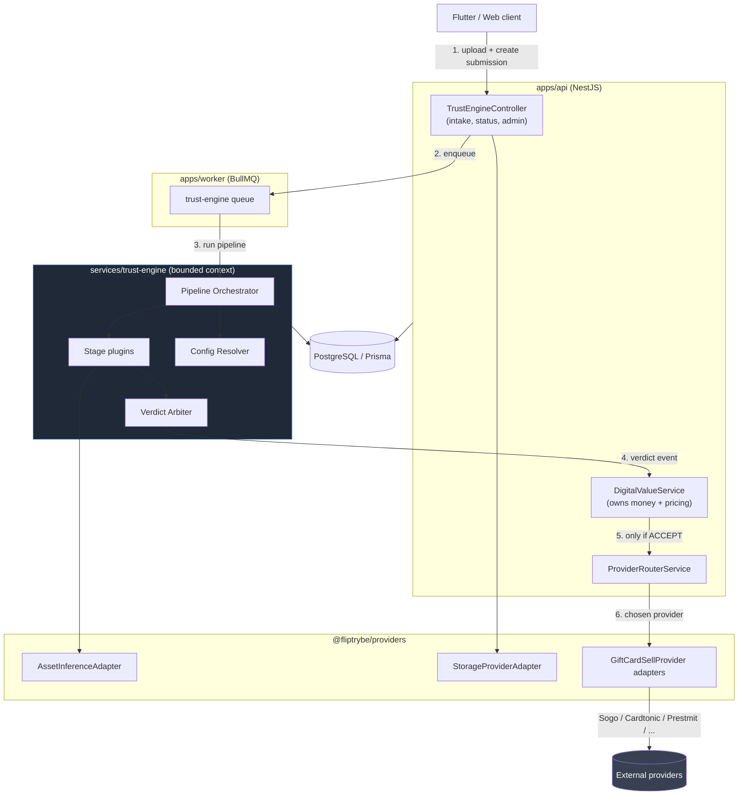
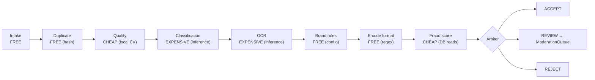
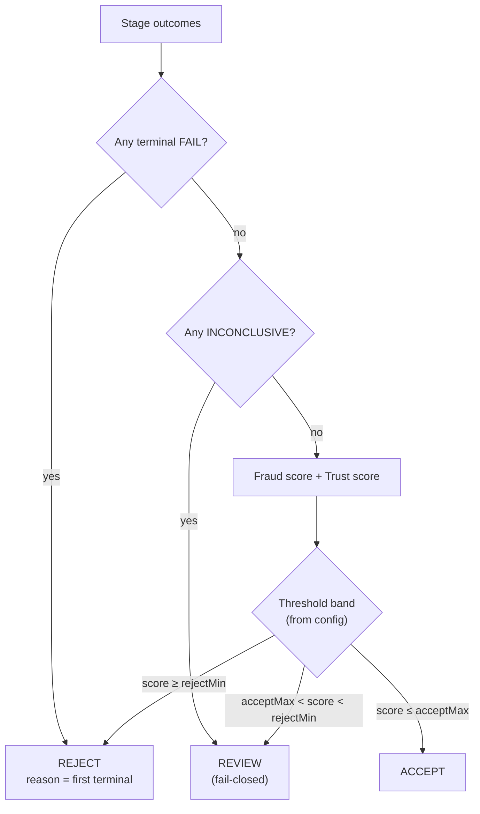

# Trust Engine — System Architecture

**Status:** Phase 0 — Design.

---

## 1. Position in the platform

The Trust Engine is a **bounded context**, not a microservice. It runs in-process
inside `apps/api` and `apps/worker`, exactly like `services/smm` and
`services/digital-access` do today. Extracting it to its own deployable is possible
later precisely because its interface is narrow — but paying distributed-systems cost
today for a service with no independent scaling need would be waste.



**Read the arrows carefully.** There is no edge from the Trust Engine to any provider.
The Trust Engine's output is an event consumed by the domain service, which *then*
decides to route. This is what makes G3 (provider independence) structurally true
rather than aspirational — the Trust Engine cannot depend on a provider because it
cannot import one. That constraint is enforced by an ESLint boundary rule, not by
good intentions.

### 1.1 Why the domain service sits between verdict and router

An alternative is Trust Engine → Provider Router directly. Rejected: routing decisions
depend on payout economics, FX, and wallet state that the Trust Engine deliberately
knows nothing about (non-goals 2 and 3). Putting the router downstream of the domain
service keeps each context able to answer only the questions it has data for.

---

## 2. The pipeline

### 2.1 Stage model

Every stage implements one interface:

```ts
interface ValidationStage<TContext = SubmissionContext> {
  readonly key: StageKey;              // 'intake' | 'classification' | ...
  readonly costTier: CostTier;         // FREE | CHEAP | EXPENSIVE
  supports(ctx: TContext): boolean;    // asset-class / config gating
  execute(ctx: TContext): Promise<StageOutcome>;
}

interface StageOutcome {
  readonly status: 'PASS' | 'FAIL' | 'INCONCLUSIVE';
  readonly signals: ReadonlyArray<Signal>;   // typed, scored, weighted downstream
  readonly reasons: ReadonlyArray<ReasonCode>;
  readonly evidenceRef?: string;             // FK to the stage's own result row
}
```

Three properties of this shape matter:

- **Stages never decide.** A stage emits `FAIL` for its own dimension; only the Arbiter
  converts stage outcomes into `ACCEPT | REVIEW | REJECT`. This is why a new stage never
  requires touching decision logic.
- **`INCONCLUSIVE` is a first-class status.** Inference timeout is not a pass and not a
  fail. Collapsing it into either is how fail-open bugs get written (acceptance A10).
- **Stages are pure w.r.t. the DB.** They receive a context and return an outcome; the
  orchestrator persists. Stages are therefore unit-testable with no database.

### 2.2 Ordering and short-circuit — the cost gradient

Stages run in ascending cost order, and the orchestrator halts on a *terminal* failure.



Note the deliberate ordering choices, each of which is a real decision:

- **Duplicate before classification.** A hash lookup costs a microsecond and an index
  hit; a vision API call costs money. A resubmitted image is the single most common
  abuse pattern, and catching it for free is the highest-leverage ordering in the whole
  pipeline.
- **Quality before classification.** A black or hopelessly blurred frame will make the
  classifier return noise. Rejecting on quality first produces a *better user message*
  ("too dark, retake in better light") than a low-confidence classification would
  ("unrecognised image").
- **Brand rules after OCR, not before.** Brand is *derived* from OCR, not asserted by
  the user. Trusting a user-supplied `brand` field is exactly how mismatched cards get
  routed to the wrong provider. The user's declared brand becomes a *signal to compare
  against*, and disagreement is itself fraud evidence.

Short-circuit is *configurable per stage* (`terminalOnFail`). Ops can decide that a
quality failure should still run classification to gather training data, at cost.

### 2.3 Signals, not booleans

Stages emit `Signal { key, value, confidence, weight? }`. The fraud model consumes
signals; the arbiter consumes the fraud score plus terminal reasons. This indirection is
what lets Phase 9 add a new scoring input without touching Phases 2–8.

---

## 3. Verdict arbitration



The bands are **configuration**, versioned, and the resolved config version is stamped
onto every `ValidationRun`. Without that stamp, acceptance criterion A9 (determinism /
replay) is unachievable — you cannot replay a decision if you cannot recover the
thresholds that produced it. This is the single most commonly omitted detail in systems
of this kind and it is the one that makes disputes unresolvable a year later.

### 3.1 Trust score interaction

Trust score does not add to the fraud score; it **shifts the bands**. A high-trust actor
gets a wider `ACCEPT` band, a new or low-trust actor a narrower one. Modelling it as a
band shift rather than a score adjustment keeps fraud evidence and actor reputation
separately auditable — a moderator can see "this submission was clean but the actor is
new" as distinct from "this submission was suspicious".

---

## 4. Concurrency, idempotency and failure

- **Idempotency:** `ValidationRun` carries a unique `idempotencyKey` derived from
  `(submissionId, configVersion, pipelineVersion)`. Re-running under identical inputs
  returns the existing run. A config change produces a *new* run, preserving the old —
  history is append-only, never mutated.
- **Retries:** stage-level, with the queue's exponential backoff. A stage that exhausts
  retries yields `INCONCLUSIVE`, which routes to `REVIEW`. It never yields `PASS`.
- **Poison submissions:** a submission whose pipeline fails hard N times moves to
  `ModerationQueue` with `SYSTEM_FAILURE`, and pages ops. It is never dropped and never
  auto-accepted.
- **Ordering:** the queue does not guarantee ordering; the pipeline does not need it.
  Each run is self-contained. Duplicate detection uses a DB uniqueness constraint on
  the hash rather than read-then-write, so two concurrent identical uploads cannot both
  win.

That last point is worth stating plainly: **duplicate detection implemented as
"SELECT then INSERT" is a race, and the race is exactly the one an attacker will
exploit** by firing N identical submissions concurrently. The constraint lives in the
database.

---

## 5. Secret handling

Card codes / PINs / serials are bearer secrets.

- Stored in a dedicated `SubmissionSecret` row, encrypted with an app-level key
  (envelope encryption, key ref in config — never the key itself).
- Never on `AssetSubmission.metadata`. The existing plaintext pattern at
  `digital-value.service.ts:183` is the anti-pattern being corrected.
- Redacted by a serialiser applied at the module boundary, so redaction is default-on
  and a new field cannot leak by omission.
- Moderator reveal is a separate authorised action that writes an `AuditLog` entry
  before returning the value.
- OCR-extracted codes are secrets too. `OcrResult` stores structure and confidence in
  the clear, and any extracted code as ciphertext.

---

## 6. Architecture decision records

**ADR-001 — Bounded context in-process, not a separate service.**
*Decision:* `services/trust-engine` consumed by `apps/api` and `apps/worker`.
*Why:* matches every existing vertical; no independent scaling requirement; avoids
network failure modes in a fail-closed path. *Reversible:* yes — the interface is
narrow by construction. *Rejected:* separate deployable (premature), inline in
`DigitalValueService` (couples validation to money, blocks reuse).

**ADR-002 — Reuse `MediaAsset`, `AuditLog`, `ProviderConfig`, `ProviderRoutingAttempt`.**
*Decision:* do not create `DuplicateImage`, `AuditLog`, `ProviderConfig` or
`SupportedProvider` tables as the brief lists them; extend what exists.
*Why:* `MediaAsset` already models uploads *with* `checksumSha256` indexed and
Cloudinary wiring. `ProviderConfig` already has `ProviderDomain.GIFT_CARD`, priority,
enablement and health. Duplicating these creates two sources of truth for "what did the
user upload" and "which providers exist" — the classic split-brain that surfaces six
months later as a reconciliation bug. *Cost:* Trust Engine takes a dependency on shared
tables. Accepted; they are platform tables, not domain tables.
*New tables are added only where no existing concept fits* (see the database doc).

**ADR-003 — Generic `AssetSubmission`, not `GiftCardSubmission`.**
*Decision:* one submission table discriminated by `assetClass`, with per-class profile
rows. *Why:* goals G4/A7 and the roadmap in PRD §7 are unachievable otherwise.
*Trade-off:* slightly more indirection today for gift cards. Accepted — this is
decision **D1** and needs sign-off.

**ADR-004 — Inference behind an adapter, hybrid execution.**
*Decision:* `AssetInferenceAdapter` in `@fliptrybe/providers` with `classify()`,
`extractText()`, `assessQuality()`; a mock implementation first, cheap local heuristics
before any paid call. *Why:* mirrors the existing adapter pattern mandated by CLAUDE.md;
makes Phases 3–5 testable with no vendor; keeps the vendor choice (**D2**) reversible.

**ADR-005 — Fail-closed by construction.**
*Decision:* `INCONCLUSIVE` is a distinct status; the arbiter's default branch is
`REVIEW`; no code path produces `ACCEPT` without an explicit positive result from every
required stage. *Why:* the cost asymmetry is severe — a wrong `REVIEW` costs a
moderator two minutes; a wrong `ACCEPT` costs a payout and the Sogo relationship.

**ADR-006 — Config is data, versioned, hot-editable.**
*Decision:* thresholds, brand rules, limits and weights live in DB rows with a version;
the resolved version is stamped on every run. *Why:* fraud adapts between deploys;
determinism requires the stamp. *Rejected:* env vars (not versioned, not auditable,
not per-brand).

---

## 7. Package boundaries

```
services/trust-engine/          domain logic, stages, arbiter, scoring — no Nest, no Prisma
  src/pipeline/                 orchestrator + stage contracts
  src/stages/                   one file per stage
  src/scoring/                  fraud model, trust model
  src/config/                   config schema + resolver
apps/api/src/modules/trust-engine/    Nest module, controller, DTOs, repository impls
packages/types/                 AssetSubmission, Verdict, ReasonCode, Signal
packages/providers/             AssetInferenceAdapter + implementations
apps/worker/src/queues.ts       'trust-engine' queue in all three exports
packages/feature-flags/         trustEngine, trustEngineAdmin
```

The domain package has **no Prisma import**. Persistence is reached through repository
interfaces defined in the domain and implemented in the API module — repository pattern
as required by the engineering standards, and the reason the pipeline is testable
without a database.
